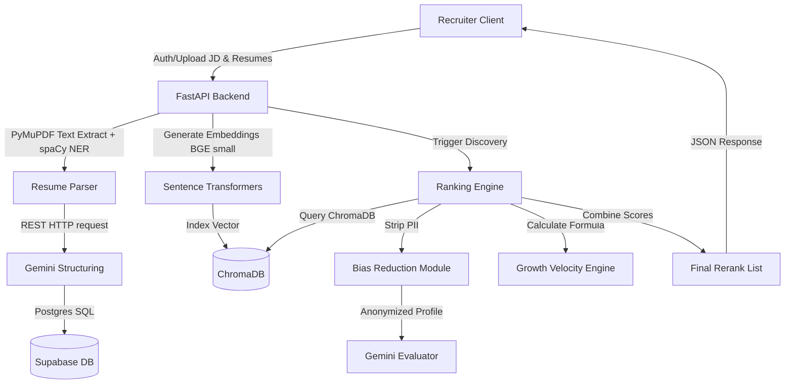

mvp link :https://talent-graph-ai-vyfz.vercel.app/


# TalentGraph AI - Intelligent Candidate Discovery MVP

TalentGraph AI is a production-quality MVP for an AI-powered Intelligent Candidate Discovery system. Unlike traditional keyword-matching ATS systems, it ranks candidates using deep semantic understanding, vector embeddings, spacy-based NER, and Gemini-based multi-factor reranking.

## 🚀 Key Features
- **Semantic Vector Search**: Generates vector representations of resumes and job descriptions using BAAI/bge-small-en-v1.5 and retrieves the top 50 matches via cosine similarity in ChromaDB.
- **Hierarchical Job Description Parser**: Categorizes requested skills into Mandatory, Preferred, and Nice-to-have hierarchies.
- **Bias Reduction Module**: Anonymizes candidates by stripping out Name, Email, specific institutions names, and locations prior to AI evaluation to promote skills-based equal opportunity screening.
- **Professional Growth Velocity Engine**: Ranks candidates based on career advancement velocity, skill acquisition rate, and project complexity rather than simple tenure years.
- **Explainability Engine**: Provides recruiters with a readable score breakdown, strengths list, and skill gap analysis for every candidate.
- **Compare Logs Audit**: Enables recruiters to inspect the actual profile side-by-side with the anonymized version sent to the AI, ensuring complete auditing compliance.
- **Premium Glassmorphic UI**: Beautiful responsive design with custom glass controls and dark mode.

---

## 🛠️ Technology Stack
- **Frontend**: React, Vite, Tailwind CSS, Lucide React, Chart.js.
- **Backend**: FastAPI (Python), Uvicorn.
- **Database**: Supabase PostgreSQL.
- **Vector Database**: ChromaDB.
- **AI Models**: Gemini API (gemini-2.5-flash), Sentence Transformers (BAAI/bge-small-en-v1.5).
- **Libraries**: PyMuPDF, spaCy (en_core_web_sm), Pydantic.

---

## 📐 Architecture Flow



---

## 📊 Database Schema (Supabase PostgreSQL)

We deploy six interconnected tables with Row Level Security (RLS) policies:

1. **`users`**: Manages recruiter accounts with email and hashed passwords.
2. **`jobs`**: Stores job descriptions, cleaned JDs, and Gemini-structured job requirements metadata.
3. **`candidates`**: Logs candidate files, upload filenames, and PDF system paths.
4. **`resume_metadata`**: Houses structured details (skills, education degree lists, experience years, projects) parsed from resumes.
5. **`candidate_embeddings`**: References candidate mappings to vector records.
6. **`ranking_history`**: Keeps records of matching discovery runs, scores (overall, technical, domain, semantic, growth), anonymized evaluation logs, and recruiter explainability panels.

---

## 🧠 Growth Velocity Formula
Instead of relying solely on raw years of experience, the **Professional Growth Velocity Engine** evaluates candidates on five dimensions using a weighted index:

$$\text{Growth Score} = (\text{Promotion Freq} \times 0.30) + (\text{Skill Expansion} \times 0.25) + (\text{Project Complexity} \times 0.20) + (\text{Cert Growth} \times 0.15) + (\text{Leadership} \times 0.10)$$

Where:
- **Promotion Frequency (30%)**: Transitions/projects relative to tenure duration.
- **Skill Expansion (25%)**: Size of the candidate's active technical toolkit.
- **Project Complexity (20%)**: Depth of scope (evaluated by keywords like scale, optimize, database design).
- **Certification Growth (15%)**: Professional certifications acquired.
- **Leadership (10%)**: Instances of mentoring, senior architect roles, or team coordination.

Candidates are categorized as:
- **High Growth**: Score $\ge$ 80
- **Medium Growth**: Score 50 - 79
- **Low Growth**: Score < 50

---

## ⚙️ Setup & Installation

### Option 1: Direct Local Run

#### Prerequisites
- Node.js v18+
- Python 3.10+
- Git

#### Backend Setup
1. Navigate to the backend directory:
   ```bash
   cd backend
   ```
2. Create and activate a virtual environment:
   ```bash
   python -m venv venv
   .\venv\Scripts\activate
   ```
3. Install backend requirements:
   ```bash
   pip install -r requirements.txt
   ```
4. Download the spaCy English model:
   ```bash
   python -m spacy download en_core_web_sm
   ```
5. Run migrations to initialize the database:
   ```bash
   python -m app.database.migrations
   ```
6. Start the server:
   ```bash
   python -m uvicorn app.main:app --host 127.0.0.1 --port 8000 --reload
   ```

#### Frontend Setup
1. Navigate to the frontend directory:
   ```bash
   cd ../frontend
   ```
2. Install frontend dependencies:
   ```bash
   npm install
   ```
3. Start the Vite React client:
   ```bash
   npm run dev -- --host 127.0.0.1
   ```
4. Open [http://127.0.0.1:5173/](http://127.0.0.1:5173/) in your web browser.

---

### Option 2: Docker Compose Run

To launch both backend and frontend automatically inside isolated containers:

1. In the root directory, run:
   ```bash
   docker-compose up --build
   ```
2. Once the build is complete:
   - Frontend client is available at: [http://localhost:5173/](http://localhost:5173/)
   - Backend API is available at: [http://localhost:8000/](http://localhost:8000/)

---

## 🧪 Running Automated Tests

A comprehensive end-to-end programmatic integration test is included in the backend:

1. Ensure the backend server is running on `127.0.0.1:8000`.
2. Navigate to the backend directory and run:
   ```bash
   .\venv\Scripts\python test_pipeline.py
   ```
3. This creates 3 mock PDF resumes, uploads them, matches them against a "Senior Python Backend Developer" JD, and outputs the resulting semantic ranking, growth velocity, and explainability breakdown.
